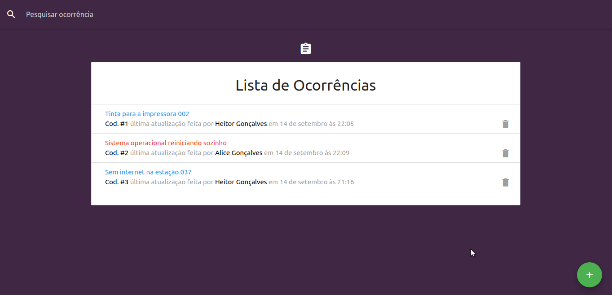

# Controle de Chamados
In inglish: Simple application built with React and its ecosystem that record TI issues and its priority level. (Brazilian Portuguese)

Simples aplicação que registra ocorrências para o setor de TI e seu nível de prioridade para atendimento.




## Funcionalidades
- Adiciona, lista, exclui e filtra ocorrências
- Seleciona técnico para o atendimento
- Adiciona nível de prioridade para o atendimento


## Tecnologias
-  [ReactJS](https://reactjs.org/)
-  [Redux](https://redux.js.org/)
-  [Redux-Saga](https://redux-saga.js.org/)
-  [React Router v4](https://github.com/ReactTraining/react-router)
-  [Materialize](https://materializecss.com)
-  [JSON Server](https://github.com/typicode/json-server)

## Executando a aplicação
```bash
# Clone o repositório
$ git clone https://github.com/marciofrancalima/tech-priority.git (ou use ssh)

# Entre na pasta criada
$ cd tech-priority

# Instale as dependências
$ yarn install (ou npm)

# Execute a aplicação
$ yarn dev
```

## Próximos passos
Aplicação simples, mas na medida que as necessidades vão surgindo, novas implementações serão desenvolvidas.

### Algumas possibilidades:

- Desenvolver a parte de backend com Node.js
- Adicionar controle de status dos atendimentos
- Adicionar relatórios gráficos com indicadores úteis de desempenho para auxiliar nas tomadas de decisões
- Adicionar controle de usuários com autenticação e autorização

---

Made with ♥ by Márcio França Lima. [Contact me](https://www.linkedin.com/in/m%C3%A1rcio-fran%C3%A7a-lima-916454187/)
